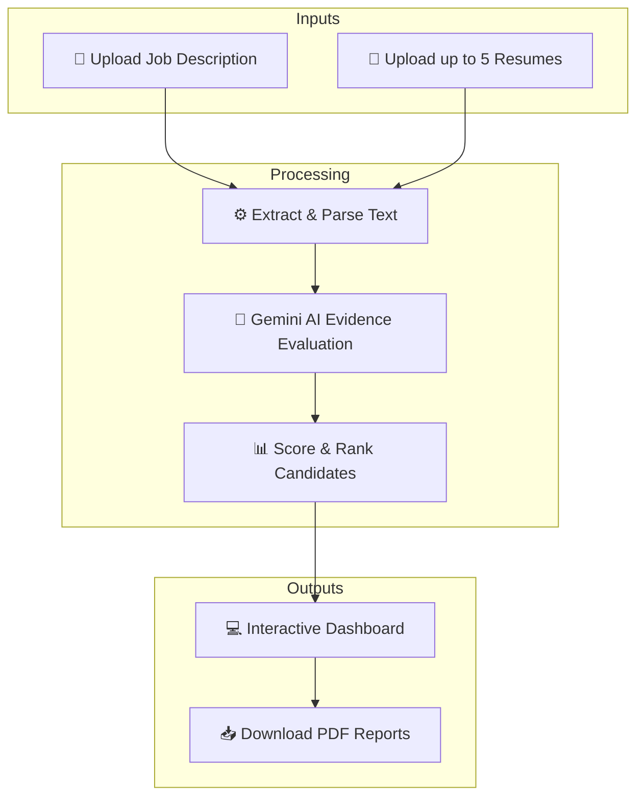
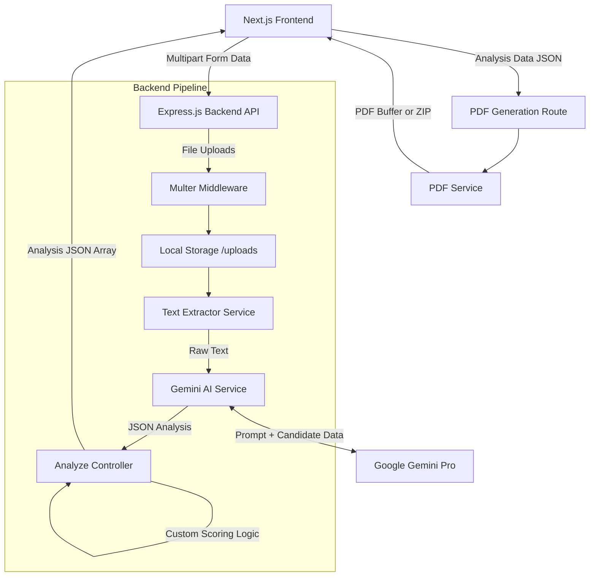

# CareerDNA AI (AI-Powered Resume JD Analyzer)

An advanced, intelligent resume and job description (JD) matching system powered by Google Gemini AI.

## Application Workflow



## Project Overview

This tool helps recruiters and job seekers analyze how well a resume matches a job description (JD) by extracting semantic features, identifying keyword matches, finding missing requirements, and providing scoring and tailored improvement suggestions.

## System Architecture

CareerDNA AI follows a modern decoupled client-server architecture built entirely in TypeScript.

### High-Level Flow
1. **Client (Next.js)**: The user uploads a Job Description and up to 5 Resumes through a premium React frontend featuring a futuristic biotech/glassmorphism UI.
2. **Server (Express.js)**: 
   - Files are temporarily saved.
   - Text is extracted from the documents using dedicated parser services.
   - A detailed prompt containing the parsed text is sent to the **Google Gemini AI Service**.
3. **AI Engine (Gemini)**: 
   - Analyzes each candidate based on evidence (skills, projects, education).
   - If multiple candidates exist, performs a comparative ranking analysis.
4. **Processing & Scoring**: The backend calculates a final weighted match score and packages the comprehensive JSON response.
5. **Report Generation**: Users can request downloadable PDF reports, which the backend generates and serves individually or as a ZIP archive.

For a comprehensive breakdown of the frontend, backend, AI pipeline, and data flow, please refer to [design.md](./design.md).

### System Architecture Diagram



## Features

- **Resume Upload & Parsing**: Supports PDF/DOCX resumes.
- **JD Parsing**: Raw text input or file upload.
- **Gemini AI Matching Engine**: Leverages LLMs to evaluate compatibility beyond just keyword searching (uses semantic matching).
- **Match Score & Report**: Generates a detailed match percentage, highlights missing key skills, and suggests edits to the resume.
- **Developers Portal**: Meet the creators of CareerDNA AI.

## Getting Started

### Prerequisites
- Node.js (v18+)
- npm
- Google Gemini API Key

### Installation

1. **Clone the repository:**
   ```bash
   git clone <repository-url>
   cd AI-Powered-Resume-JD-analyzer
   ```

2. **Backend Setup:**
   ```bash
   cd backend
   npm install
   ```
   Create a `.env` file in the `backend` directory and add:
   ```env
   PORT=5000
   GEMINI_API_KEY=your_gemini_api_key_here
   ```
   Run the backend:
   ```bash
   npm run dev
   ```

3. **Frontend Setup:**
   ```bash
   cd frontend
   npm install
   ```
   Run the frontend:
   ```bash
   npm run dev
   ```

4. **Open in Browser:** Navigate to `http://localhost:3000`
