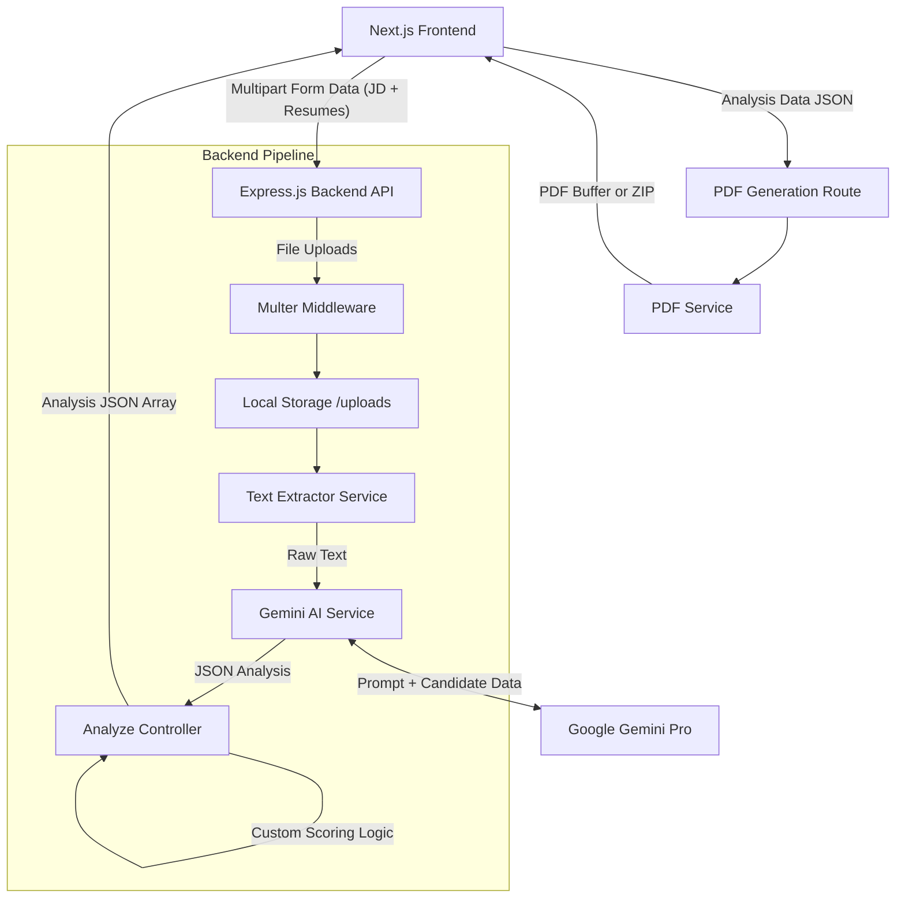

# CareerDNA AI - System Design and Architecture

## 1. System Overview
CareerDNA AI is an intelligent recruiting and talent intelligence platform. The system operates on a client-server architecture, where the client is a Next.js web application providing a premium SaaS user experience featuring futuristic AI/Biotech aesthetics, and the server is an Express.js Node application responsible for heavy-lifting tasks like file parsing, AI processing via Google Gemini, and PDF generation.

## 2. High-Level Architecture Diagram

## 3. Frontend Architecture (Next.js)
The frontend is a dynamic web application built with React and Next.js (App Router). 
- **State Management**: Uses React `useState` to transition between `upload`, `loading`, and `results` states to provide a seamless Single Page Application feel.
- **UI/UX**: Features a premium futuristic, glassmorphism aesthetic with DNA-themed animations using Framer Motion.
- **Component Structure**:
  - `app/page.tsx`: The main orchestration file managing the state flow with dynamic background animations.
  - `app/developers/page.tsx`: A dedicated developers section to showcase the creators.
  - `UploadPortal.tsx`: Reusable component for drag-and-drop file uploading.
- **Communication**: Communicates with the backend via the standard `fetch` API.

## 4. Backend Architecture (Express.js)
The backend acts as an orchestrator for file processing and AI interaction.
- **Controllers (`analyzeController.ts`)**: Handles incoming HTTP requests, orchestrates the validation, delegates to services, and returns responses. It implements the scoring weights logic (Skill Match, Project Score, etc.) and Multi-Resume Comparison logic.
- **Services**:
  - `textExtractor.ts`: Parses text from uploaded PDFs/DOCXs.
  - `geminiService.ts`: Manages communication with the Google Gemini API, including prompt engineering and JSON response parsing.
  - `pdfService.ts`: Generates formatted PDF reports.
- **Storage**: Uses local file storage temporarily (`/uploads` directory) to process files before asynchronous cleanup.

## 5. AI Pipeline & Scoring Engine
The AI pipeline relies on Google Gemini.
- **Evidence-Based Prompting**: The system forces the LLM to justify scores based on concrete evidence in the resume rather than simple keyword matching.
- **Multi-Stage Processing**:
  1. **Individual Analysis**: Each resume is analyzed independently against the JD to generate scores and feedback.
  2. **Multi-Candidate Comparison**: If multiple resumes are uploaded, a secondary AI pass compares the candidates collectively to rank them and assign "awards" (e.g., Best Technical Candidate).
- **Custom Backend Scoring**: While the AI provides base scores (0-100) for different categories (skills, education, projects), the backend calculates the `finalScore` using a custom weighted formula (e.g., Skill Match 30%, Projects 25%, etc.).

## 6. Data Flow Sequence
1. **User Upload**: User uploads JD and Resumes via the Next.js frontend.
2. **Request Submission**: Frontend sends a `POST /api/analyze` request with `multipart/form-data`.
3. **Extraction**: Backend saves files temporarily, extracts text, and prepares prompts.
4. **AI Processing**: Backend calls the Gemini API for each resume in parallel/sequence.
5. **Score Calculation**: Backend calculates final weighted scores based on AI metrics.
6. **Comparison (Optional)**: If >1 candidate, backend calls Gemini for a comparison ranking.
7. **Response**: Backend returns a JSON array of detailed candidate profiles and rankings.
8. **PDF Generation**: User requests report download. Frontend sends JSON data to `POST /api/generate-pdf`. Backend generates PDF(s) and returns a PDF stream or ZIP archive.
